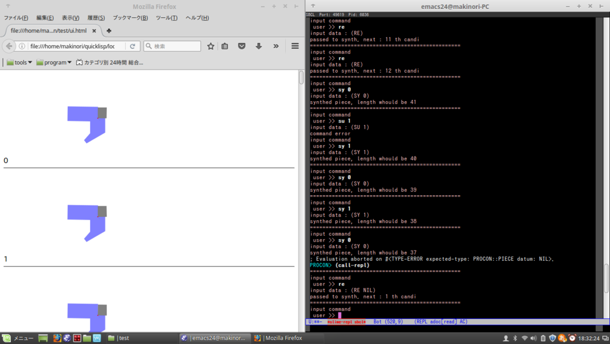

---

layout: default
---

# 制作物など
## 過去の異物
[github](https://github.com/Makinori)もあまり整備されていないので、リストしていきます。
### 点に接触するゲーム


```
$ python neuralnet_ai.py
```

[github]()

### パズル組み立て支援システム


[第27回 プログラミングコンテスト 競技部門](https://www.google.co.jp/search?q=%E7%AC%AC27%E5%9B%9E+%E9%AB%98%E5%B0%82%E3%83%97%E3%83%AD%E3%82%B3%E3%83%B3+%E7%AB%B6%E6%8A%80%E9%83%A8%E9%96%80)(おいgoogle)で作成したプログラム  
物理的に与えられたパズルを、各種の処理の後に、物理的に埋めていく競技である。  
自分は、パズルのピースを誤差を含むベクトルの情報として受け取って、最も接合する可能性の高い組み合わせを表示していくプログラムを作成した。  
[ブログ](http://ikemaki.hatenablog.com/entry/2016/10/10/234703)が特に参考になる  

- [ブログ](http://ikemaki.hatenablog.com/entry/2016/10/10/234703)
  - 何時・何をやって、どのような反省を持ったかを記述し、プログラムの概要を説明している
- [github](https://github.com/Makinori/procon_solve)
  - `doc/` 以下の日本語は、古い方のアルゴリズムのメモである
  - `wiki` は何を担当しているかを説明している。(おい大会運営!)

### サッカーをするロボット(制御部)


## レポート・プレゼンなど

- [情報技術研究部の新入生歓迎会でのプレゼン](/assets/welcome_presen.pdf)
  - その場のノリで作ってしまった。部員向けの自己紹介のプレゼン
- ["学校時代一番頑張ったことはなんですか？５分程度で説明して下さい"と言われて作ったプレゼンと原稿](assets/5min_intro.pdf)
  - カットされている部分も結構ある。5分で収めるのは難しい
- [インターンでの経験](/assets/intern_report.pdf)
  - 現在、追加で思うことは、
  - 仕様についての質問が不足したために、開発に取り掛かるのが遅くなってしまった。
   なお、制御基板自体の動作を調べるのが楽しかったからということもある。
  - 定時になったらすぐに帰ってしまったり、昼食で他の社員の人とのコミニュケーションを余り取れなかった。　また、終了後の交流なども持っていない
  - もっと主体的に動けばよかった
  - Cのマクロは何が悪い!!!


